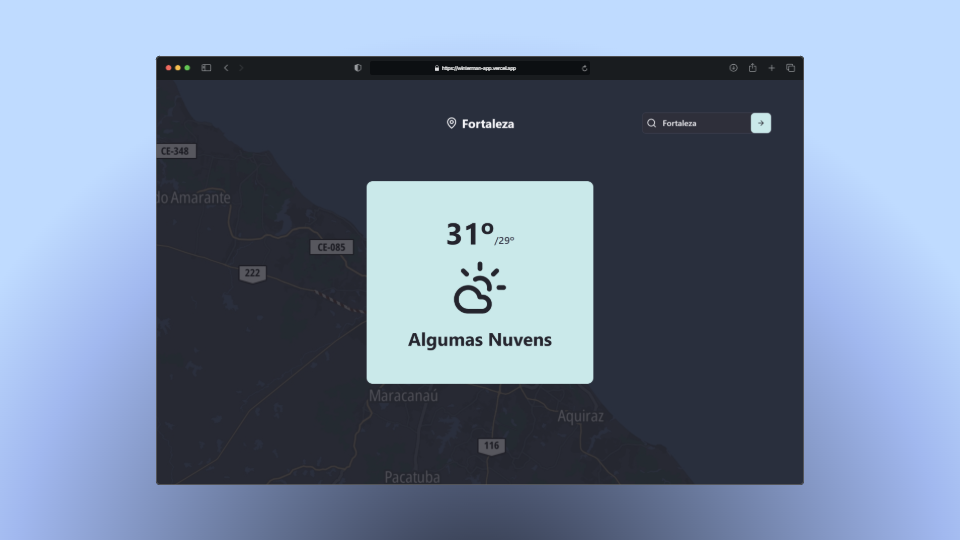
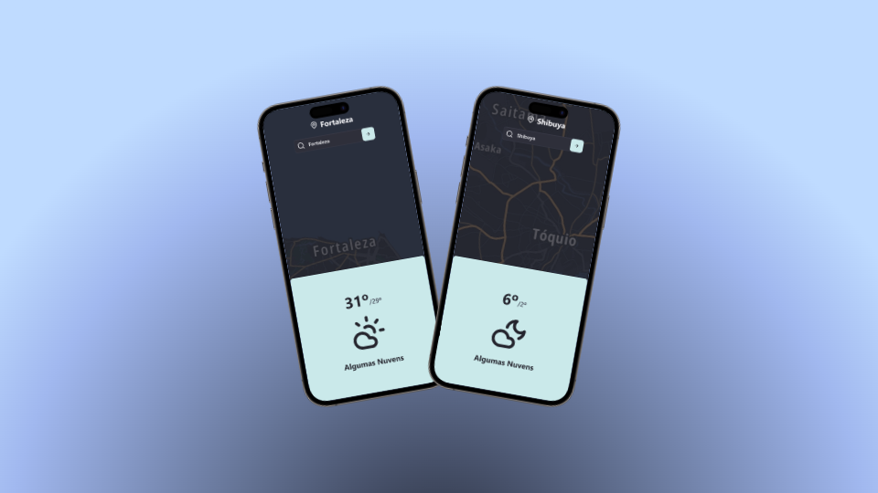

<h1 align="center">
   
   <br>
   <span>Winterman</span>
</h1>

<h4 align="center">
    Seu clima, na ponta dos dedos.
</h4>

<p align="center">
   <a href="#snowman-sobre-o-projeto">Sobre o Projeto</a> •
   <a href="#art-visual-do-projeto">Visual do Projeto</a> •
   <a href="#wrench-tecnologias">Tecnologias</a> •
   <a href="#rocket-configurações-e-instalação">Configurações e Instalação</a> •
   <a href="#balance_scale-licença">Licença</a>
</p>


## :snowman: **Sobre o Projeto**

O Winterman é um projeto criado com a [Open Weather API](https://openweathermap.org), uma API de clima, e se baseia em um página que traz o clima da cidade que o usuário pesquisar.

<p align="center">
   <a href="https://winterman-app.vercel.app">Veja o projeto completo aqui.</a>
</p>

## :art: **Visual do Projeto**




## :wrench: **Tecnologias**

Tecnologias utilizadas no projeto.

### **Construção do site**

- [TypeScript](https://www.typescriptlang.org)
- [Vue.js](https://vuejs.org)
- [Open Weather API](https://openweathermap.org)
- [TomTom API](https://www.tomtom.com)
- [Vite](https://vitejs.dev/)

### **Estilização**

- [Tailwind CSS](https://tailwindcss.com)
- [Lucide Icons](https://lucide.dev)
- [Google Fonts](https://fonts.google.com)

### **IDE, Versionamento e Deploy**

- [Visual Studio Code](https://code.visualstudio.com)
- [Git](https://git-scm.com)
- [GitHub](https://github.com)
- [Vercel](https://vercel.com/)

## :rocket: **Configurações e Instalação**

### Requisitos

- [Node](https://nodejs.org/) e um gerenciador de pacotes, usei [npm](https://www.npmjs.com).
- Extensão [Volar](https://marketplace.visualstudio.com/items?itemName=Vue.volar).

Recomendo que veja a [documentação de configuração do Vite](https://vitejs.dev/config/).

```shell
# Clonando o projeto
git clone https://github.com/davsilvam/winterman-app.git

# Instalando as dependências
npm install

# Criar arquivo .env com base no .env.example e preencher o campo com suas chaves das API
VITE_OPEN_WEATHER_API_KEY="<sua-chave-aqui>"
VITE_TOMTOM_API_KEY="<sua-chave-aqui>"

# Compilar e abrir o programa para desenvolvimento
npm run dev

# Compilar e minificar para produção
npm run build
```

## :balance_scale: **Licença**

Esse projeto está sob a [licença MIT](https://github.com/davsilvam/winterman-app/blob/main/LICENSE.md).

---

Feito com 💙 e ☕ por <a href="https://www.linkedin.com/in/davsilvam/">David Silva</a>.

> [Portfólio](https://davidsilvam.vercel.app) &nbsp;&middot;&nbsp;
> GitHub [@davsilvam](https://github.com/davsilvam) &nbsp;&middot;&nbsp;
> Instagram [@davsilvam_](https://www.instagram.com/davsilvam_/)
