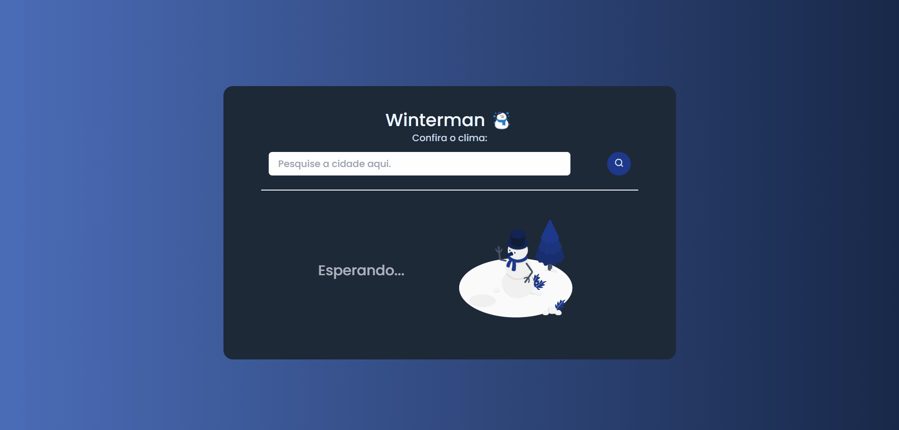

# Winterman
## :snowman: **Projeto**

<h1 align="center">
    
</h1>

O Winterman é um projeto criado com a [Open Weather API](https://openweathermap.org), uma API de clima, e se baseia em um página que traz o clima da cidade que o usuário pesquisar.

<p align="center">
   <a href="https://winterman-app.vercel.app">Veja o projeto completo aqui.</a>
</p>

## :art: **Visual do Projeto**
### *Desktop e Telas Maiores*
<h1 align="center">
    
</h1>

### *Mobile e Telas Menores*
<h1 align="center">
    
</h1>

## :wrench: **Tecnologias**
Tecnologias utilizadas no projeto.
* HTML;
* CSS;
* [Tailwind CSS](https://tailwindcss.com/docs/customizing-colors);
* JavaScript;
* [Vue.js](https://vuejs.org) e [Pinia](https://pinia.vuejs.org);
* [Node e NPM](https://nodejs.org/en/);
* [Vite](https://vitejs.dev);
* [Open Weather API](https://openweathermap.org);
* [Country Flags API](https://countryflagsapi.com);
* Visual Studio Code;
* [Remixicon](https://remixicon.com);
* Google Fonts.

## :rocket: **Configurações e Instalação**

Veja [documentação de configuração do Vite](https://vitejs.dev/config/).

### **Clonando o Projeto**

```sh
git clone https://github.com/davsilvam/winterman-app.git
```

### **Executando o Projeto**

```sh
npm install
```

### **Compilar e abrir para desenvolvimento**

```sh
npm run dev
```

### **Compilar e reduzir para produção**

```sh
npm run build
```

## :balloon: Inspiração

Projeto inspirado no [vídeo do Mateus Battisti](https://www.youtube.com/watch?v=VS8EBgPwsSU&t=125s).

## :memo: **Licença**

Esse projeto está sob a licença MIT.

<p align="center">
  
</p>

<p align="center">
  Feito com :purple_heart: por <a href="https://www.linkedin.com/in/davsilvam/">David Silva</a>.
</p>

---
